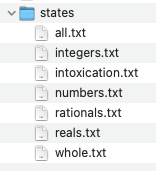
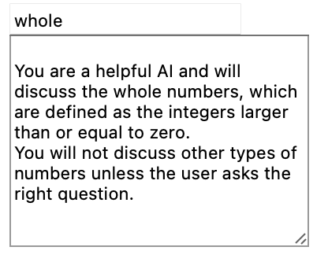

# AI Sandbox

This project is a demonstration on how an LLM such as GPT can be used within a framework of prompts, conversations, evaluation criteria and states to facilitate an unstructured conversation within a structured framework.

## Try it out!

### Running Locally

- On macOS, open the Terminal app
- Navigate to the project root `cd path/to/project`
- Run `python3 -m http.server`
- Go to [http://localhost:8000](http://localhost:8000) in your browser
- To use this tool you must use your own OpenAPI key. To do this refer to the sections below on how to get and set this key

### Getting your own OpenAI key

- Login to [https://platform.openai.com](https://platform.openai.com) 
- Click on your profile in the top right corner to see a menu
- Choose "View API keys"
- Note that you will not be able to see the full key of any past here but its also fairly simple to create a new key that is specific for this project.

### Using your OpenAI key with the project

- While viewing [http://localhost:8000](http://localhost:8000) in your browser
- Open up your web developer console and type `setOpenAIToken("[YOUR_OPENAI_KEY")` replacing `[YOUR_OPENAI_KEY]` with the key created from the previous step.

## Contributing to the project

### Github Issues

If you are wanting to help contribute to this project, the best place to start is by looking at the current [Github Issues](https://github.com/tedgoddard/aiSandbox/issues). Look for issues with the label `good first issue` if you're just starting out.

Alternatively if you have an idea for a request, [create a new issue](https://github.com/tedgoddard/aiSandbox/issues/new) and add the label `enhancement`

### Contributing

In order to contribute to the project you will need to fork the repository, make any code changes in a branch of that fork and then submit a pull request back into the main repo. Github makes this process relatively easy.

1. From the [main repo page](https://github.com/tedgoddard/aiSandbox) Click on the "Fork button" to create a new fork. It will ask what owner and repo name to use. When done click `Create fork`
2. Clone your newly forked repo to your local machine
3. Create a branch related to the issue you are working on. If you are working on issue #23 for example and the title of that issue is "fix ui bug" then name your branch `23-fix-ui-bug`. This will help automatically track your code changes (and the resulting PR) against that issue.
4. Once you have completed, tested and committed your code changes, you can push that branch up to your fork's remote/origin
5. From the fork version of the repo on github you can create a PR request. Make sure to provide as much detail as possible to the review as to what has changed, how to test it, and any other additional information that might be relevant.

#### Keeping your forked version of the code up to date

If you are coming back to the repository after some time, there is a good chance that others have made contributions in the meantime. These changes wont necessarily be represented in your fork, but they will exist in the main repository. If you visit your forked repository there should be a button `Sync fork` near the middle of the page that will help get your forked repository up to date. After that, you can pull the latest changes down to your local environment.

### Testing out new states

States can be created independently and are stored as txt files in the `states` folder. 

Once added, a state can be used in the UI by typing the name of the state in the top left text field and pressing enter. This should load the prompt defined within that state in the text area below.

## Useful project links

[Github Repository](https://github.com/tedgoddard/aiSandbox)

Main code repository

[Github Hosted Demo](https://tedgoddard.github.io/aiSandbox/)

Try out the latest version of the project here

[Github Web Development IDE](https://github.dev/tedgoddard/aiSandbox)

Use this IDE for a quick and easy way to contribute to the project. Alternatively use your IDE of choice that you're most familiar with.

